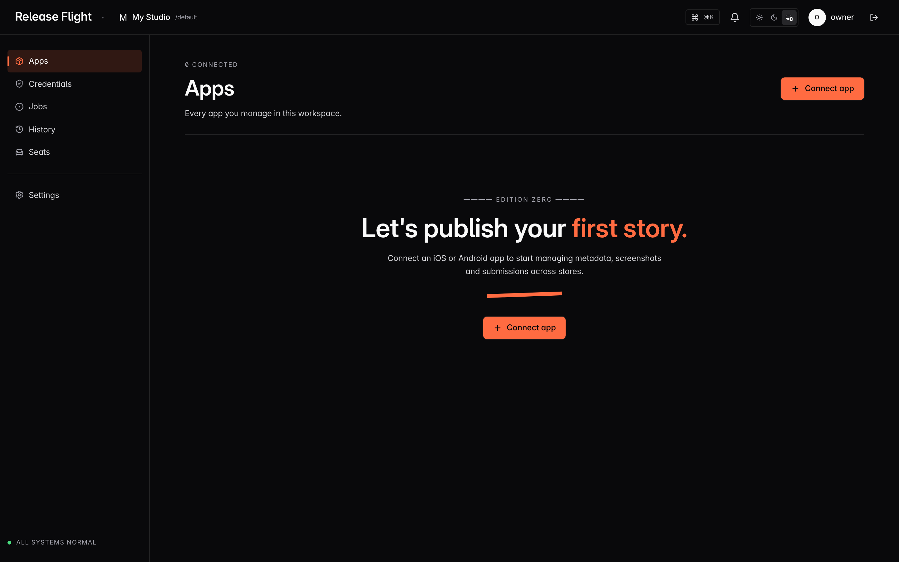
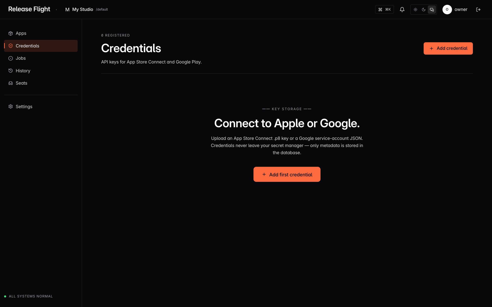

<div align="center">

# Release Flight — Community Edition

**The open-source control surface for App Store Connect & Google Play.**

Metadata, screenshots, app previews, ASO intelligence, and a build-and-deploy
pipeline for games and apps — multi-tenant, self-hostable, yours to run.

[](LICENSE)
[](#-self-host-in-one-command)
[](https://releaseflight.com)

[Self-host](#-self-host-in-one-command) · [Why open source?](#-why-open-source) · [How it compares](#-how-it-compares) · [What's included](#-whats-in-the-community-edition) · [Architecture](#-architecture) · [Community vs. Commercial](#-community-edition-vs-commercial) · [Contributing](CONTRIBUTING.md)

</div>

---

Release Flight is the storefront-operations tool with a build pipeline baked in:
manage your store metadata, screenshots and app previews across every locale,
run ASO keyword intelligence, and build/sign/ship your iOS & Android apps — all
from one self-hosted surface.

This repository is the **Community Edition** — the full open-source core under
**AGPL-3.0**. It is a complete, working product you can self-host for free, with
no license key, no feature flags, and no seat limit. The no-setup desktop
installer and the (upcoming) managed cloud are the
[commercial edition](#-community-edition-vs-commercial) — they fund the project
but they are not required to run it.

## 🖼️ Demo

Real screenshots from a fresh [`./scripts/install.sh`](#-self-host-in-one-command) run:



Your store credentials never leave your secret manager — only metadata touches the
database. That's the whole point of [running it yourself](#-why-open-source):



<!-- TODO(launch): add a 10–15s workflow GIF (edit metadata → run a build → deploy)
     as the hero, captured against an instance with a real connected app. Regenerate
     these stills any time with: node scripts/capture-screenshots.mjs -->

> Want to see it live? The [one-command install](#-self-host-in-one-command) gives
> you the full product on `localhost:3000` in a few minutes.

## 🔐 Why open source?

Every hosted publishing tool eventually asks you to upload your App Store Connect
`.p8` key, your Google Play service-account JSON (which contains an actual RSA
private key), your Firebase service account, and your Android keystore. That is
the most sensitive material your project has — the keys to *ship as you*.

Release Flight is open-source and self-hosted so those keys never have to leave
your infrastructure. The repository that holds your signing material is the same
repository you can read, audit, and run yourself. Trust is earned by being
inspectable, not asserted in a privacy policy.

That trust is backed by enforced architecture, not promises:

- **Multi-tenant isolation in PostgreSQL Row-Level Security**, not just app code —
  the app connects as a non-superuser role and scopes every query at the database,
  so a missing `where` clause can't leak another workspace's data (it fails closed).
- **AES-256-GCM encryption for secrets at rest**, bound to the owning tenant,
  never logged, never returned to the browser, never passed to subprocesses via argv.
- **Strict per-request CSP** with nonces (no `unsafe-inline` in production),
  timing-safe double-submit **CSRF** on every mutation, and **SSRF guards** on every
  outbound fetch of a user-supplied URL.
- **Append-only audit log** the app role cannot UPDATE or DELETE.

These protections are regression-tested in CI — run `pnpm test:security` to see the
suite that guards them. See [SECURITY.md](SECURITY.md) and [`docs/`](docs/) for the
threat model and details.

## ⚖️ How it compares

Most teams assemble release operations from several tools. Release Flight unifies
the pieces into one self-hosted surface. Each of the tools below is good at what it
does — they just solve different slices of the problem:

| | Metadata & store listings | Screenshots / previews | ASO intelligence | Build & sign | Deploy to stores | Open source | Self-hostable |
|---|:---:|:---:|:---:|:---:|:---:|:---:|:---:|
| **Release Flight** | ✅ | ✅ | ✅ | ✅ | ✅ | ✅ (AGPL) | ✅ |
| **Fastlane** | partial (CLI) | partial (CLI) | ❌ | ✅ | ✅ | ✅ | ✅ |
| **Bitrise / Codemagic** | ❌ | ❌ | ❌ | ✅ | ✅ | ❌ | ❌ (SaaS) |
| **ASO tools** (AppTweak, Sensor Tower, AppFollow…) | ❌ | ❌ | ✅ | ❌ | ❌ | ❌ | ❌ (SaaS) |

The honest summary:

- **Fastlane** is an open, scriptable CLI/CI layer for builds and store uploads —
  powerful and a great fit alongside Release Flight, but it's Ruby automation you
  maintain, with no UI, no ASO, and no shared team surface.
- **Bitrise / Codemagic** are excellent managed build farms, but they stop at the
  binary — no metadata, screenshots, or ASO — and they're closed SaaS.
- **ASO tools** give you keyword and competitor intelligence, but never touch your
  actual store listing or your build.

Release Flight's bet is that the *coordination* layer — metadata, screenshots, ASO,
and deploy in one place you own — is the missing piece. It complements Fastlane
rather than replacing it.

## ✨ What's in the Community Edition

- **Metadata studio** — edit App Store Connect & Google Play listings across all
  locales, with diffing, history, and master-JSON import/export.
- **Screenshots & app previews** — upload, organize, apply-to-locales, validate
  against store specs, and push.
- **ASO intelligence** — keyword scoring, competitor tracking, AI keyword
  suggestions, and a daily-check engine.
- **Build & deploy pipeline** — a macOS runner that clones your repo, detects the
  framework, builds IPA/AAB/APK, signs, and deploys to Firebase / App Store
  Connect / Google Play.
- **Multi-tenant by design** — workspace isolation enforced by **PostgreSQL
  Row-Level Security** (not just app code), per-member app scoping, append-only
  audit log.
- **Secure by default** — AES-256-GCM secrets at rest, strict per-request CSP
  with nonces, SSRF guards on every outbound user URL, CSRF on every mutation.

## 🚀 Self-host in one command

> **Requirements:** Docker + Docker Compose v2, plus `openssl` and `curl` (preinstalled
> on macOS and most Linux). The macOS build runner additionally needs Xcode / Android
> SDK on a Mac — see [docs](docs/).

```bash
git clone https://github.com/gripati/releaseflight.git
cd releaseflight
./scripts/install.sh        # generates secrets, builds images, migrates, starts everything
```

Then open <http://localhost:3000> and sign in with the owner account printed by
the installer. That's it — no license, no limits, unlimited seats.

> **Don't want to touch Docker?** A signed, no-setup macOS **desktop installer**
> stands up the whole stack for you (your keys still never leave your machine).
> See [Community vs. Commercial](#-community-edition-vs-commercial).

For development instead of a container stack, see [CONTRIBUTING.md](CONTRIBUTING.md).

## 🧱 Architecture

A pnpm + Turbo monorepo (Next.js 15 / React 19, Prisma + Postgres with RLS,
BullMQ workers).

```
apps/
  web      Next.js app — 90+ /api/v1 route handlers, App Router pages
  worker   BullMQ consumers (ASO research, metadata fetch jobs)
  runner   macOS build agent — clone → detect → build → sign → deploy
packages/
  core     store adapters (Apple/Google/Firebase) + crypto + SSRF guard + errors
  db       Prisma schema + RLS policies + tenant context
  secrets  AES-256-GCM envelope encryption
  storage  filesystem / S3 object storage
  aso      ASO keyword intelligence (client-bundle-safe)
  api-contracts  zod request/response contracts
  cache · jobs · observability · email · ui
```

Tenant isolation, secrets-at-rest, CSP, and SSRF protections are **invariants** —
see [docs/07_SECURITY.md](docs/07_SECURITY.md) and the rest of [`docs/`](docs/).

## 💼 Community Edition vs. Commercial

Release Flight is **open-core**. This repo is the complete, free, self-hostable
core — and it stays that way. The commercial edition adds the parts most people
don't want to run themselves, and funds continued development:

| | Community Edition (this repo) | Commercial |
|---|---|---|
| **Price** | Free, forever | Desktop installer ~$19/mo Indie · ~$39/mo Studio · custom for enterprise |
| **License** | AGPL-3.0 | Commercial license available |
| **How you run it** | Self-host with Docker (one command) | Signed macOS desktop installer (no Docker) · managed cloud *(coming)* |
| **Seats & apps** | Unlimited | Per your plan |
| **Full feature set** | ✅ metadata, screenshots, ASO, build & deploy | ✅ same product |
| **Setup effort** | You run the stack | We package / host it for you |
| **Licensing, seat management, billing, operator console** | — | ✅ |
| **Support** | Community ([Discussions](https://github.com/gripati/releaseflight/discussions)) | Commercial support |

The paid side is **convenience, not an unlock** — the open core is the same code,
not a crippled demo. You pay to *not run it*, never to remove a limit.

- **Desktop installer** — a signed macOS app that installs and runs the whole
  stack locally, no Docker knowledge needed. Available at
  [releaseflight.com](https://releaseflight.com).
- **Managed cloud (hosted)** — *coming.* We'd host it so you skip the ops entirely.
  Not available yet — [join the waitlist at releaseflight.com](https://releaseflight.com).

Need a commercial license, or can't meet the AGPL's terms?
[See your options →](https://releaseflight.com)

## 📜 License

Community Edition is licensed under **GNU AGPL-3.0-or-later** (see [LICENSE](LICENSE)).
A separate **commercial license** is available for organizations that cannot meet
the AGPL's terms. See [LICENSING.md](LICENSING.md) for the full picture and the
open-core boundary.

## 🤝 Contributing

This repo is the upstream source of truth for the open core — the open core gets
every feature first, and contributions land here. Start with
[CONTRIBUTING.md](CONTRIBUTING.md). Found a security issue? Please follow
[SECURITY.md](SECURITY.md).

If Release Flight is useful to you, a ⭐ genuinely helps it keep being built in the
open.
